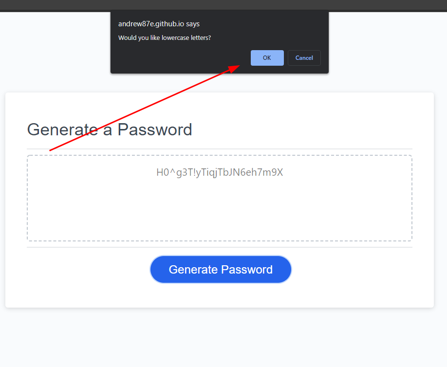

# Password Generator
 ## A simple JS Password Generator
 Made for challenge 3 UT-Austin coding bootcamp

## Demo

[Here is a demo of it in action!](https://andrew87e.github.io/Password-Generator/) 

## Instructions

Click the Generate Password button to be presented with a series of prompts. 

Next you will be presented with a prompt asking how many characters you want your password to be. 

    
No funny business here

     
    The generator will stop here and alert if a valid number is not entered.
        
    

Choose if you want Uppercase letters in your password or not. Ok for yes, Cancel for no.

Choose if you want Lowercase letters in your password or not.

Choose if you want Numbers in your password or not. 

Finally, choose if you want special characters in your password or not. 

Once you make all of your choices. your password will be displayed inthe box!

## Team

[Andrew Edwards](https://github.com/andrew87e) 

## [License](https://github.com/Andrew87E/Horiseon-Marketing/blob/main/LICENSE)
 

MIT © [Andrew Edwards](https://github.com/andrew87e)